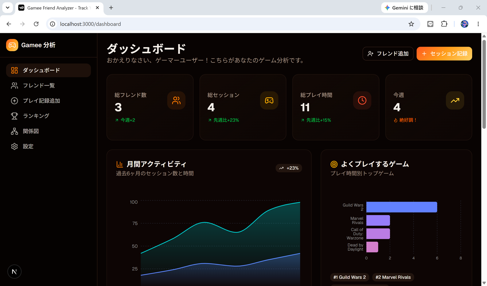
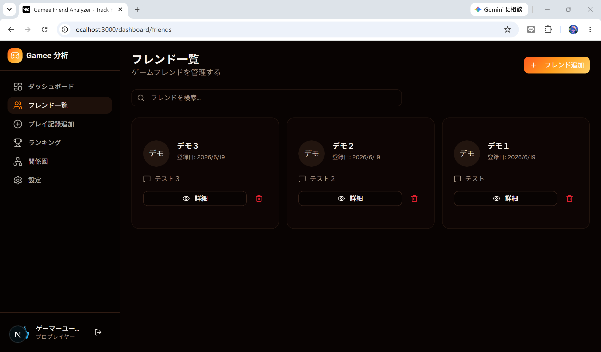
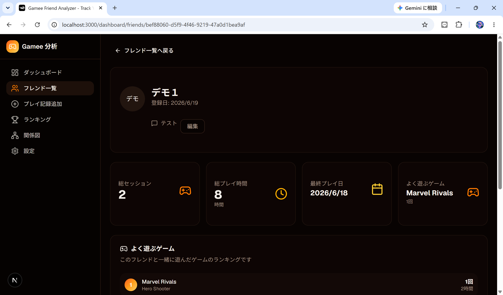
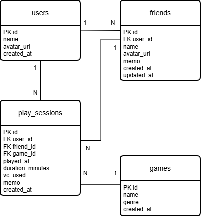

# Gamee Friend Analyzer

ゲーム仲間とのプレイ履歴を記録・管理するWebアプリです。

## 概要

ゲーム募集などで久しぶりに一緒に遊ぶ相手に対して、

* 前に何を遊んだか
* どれくらい一緒に遊んだか
* どんな人だったか

を忘れてしまうことがあります。

Gamee Friend Analyzerは、ゲーム仲間とのプレイ履歴やメモを記録することで、過去の交流を振り返りやすくするために開発しました。

コンセプトは

> また一緒に遊ぼう。

です。

---

## スクリーンショット

### ダッシュボード

### フレンド一覧

### フレンド詳細

---

## URL

[リンク](https://gamee-friend-analyzer-xic1.vercel.app/)

---

## テストアカウント

| 項目      | 内容                                          |
| ------- | ------------------------------------------- |
| メールアドレス | demo@gfa.local |
| パスワード   | demo1234$                                    |

---

## 主な機能

### 認証機能

* ユーザー登録
* ログイン
* ログアウト

### フレンド管理

* フレンド追加
* フレンド一覧表示
* フレンド詳細表示
* フレンド編集
* フレンド削除

### プレイ記録管理

* セッション追加
* セッション一覧表示
* セッション削除

### 分析機能

* 総フレンド数表示
* 総セッション数表示
* 総プレイ時間表示
* フレンドランキング
* よくプレイするゲームランキング
* 最近のプレイ履歴表示

---

## 使用技術

### フロントエンド

* Next.js
* TypeScript
* React
* Tailwind CSS
* shadcn/ui

### バックエンド

* Supabase

### データベース

* PostgreSQL（Supabase）

### 認証

* Supabase Auth

### グラフ

* Recharts

### デプロイ

* Vercel

---

## ER図

---

## 工夫した点

### 1. ユーザーごとのデータ分離

SupabaseのRow Level Security（RLS）を利用し、ログインユーザーが自分のデータのみ閲覧・操作できるように実装しました。

### 2. CRUD機能の実装

フレンド情報およびプレイ履歴について、作成・参照・更新・削除の一連の操作を実装しました。

### 3. 実データによる集計機能

登録されたプレイ履歴をもとに、

* フレンドランキング
* プレイ時間集計
* ゲームランキング

をリアルタイムに表示できるようにしました。

---

## テスト・修正の設計および実施書
[テスト・修正の設計及び実施書_Googleスプレッドシート](https://docs.google.com/spreadsheets/d/1ph7XaLu4a2k_kDBEpj_ySTBPETJvg5143ZMk5G90DUA/edit?gid=799863560#gid=799863560)

---

## アプリの改善案
[アプリの改善案_Googleスプレッドシート](https://docs.google.com/spreadsheets/d/1fgynpBKhx8zaNkMweeYVQl52bP6Z8dJZOmmY8MHXjQM/edit?gid=0#gid=0)

---

## 今後追加したい機能

* セッション編集機能
* フレンドアイコン画像アップロード
* フレンド関係図の可視化
* AIによるプレイ履歴要約機能
* Googleログイン対応

---
